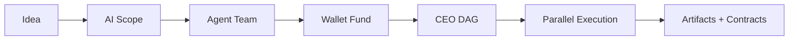
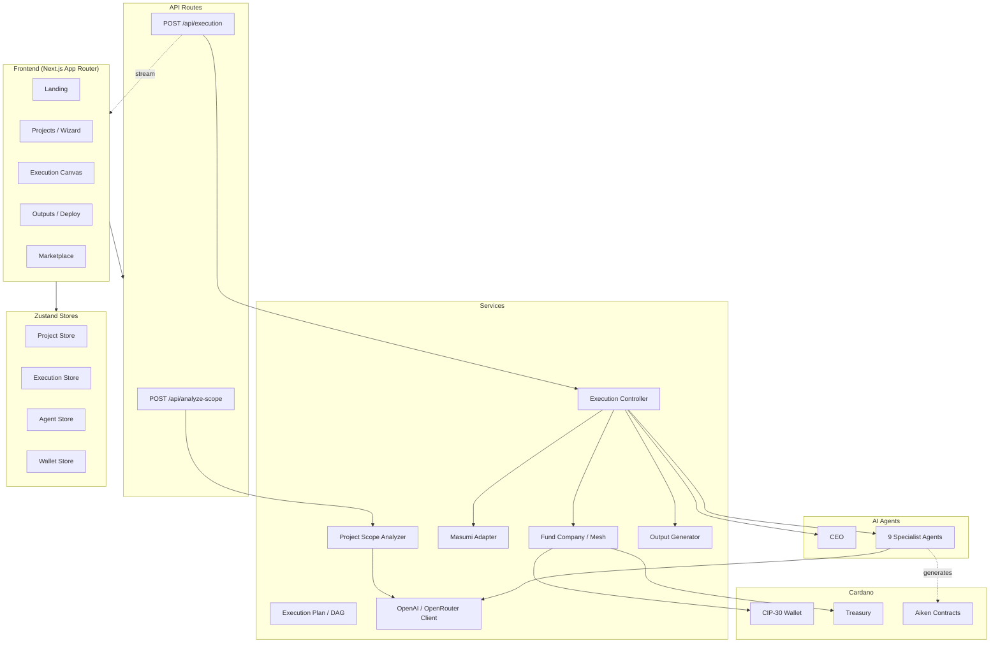
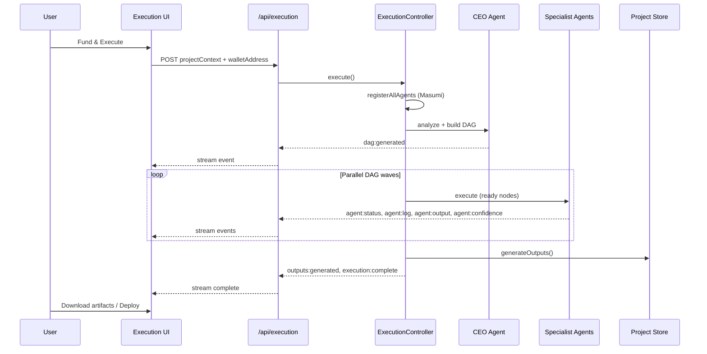
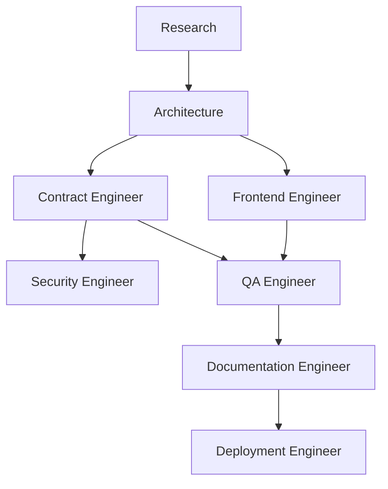
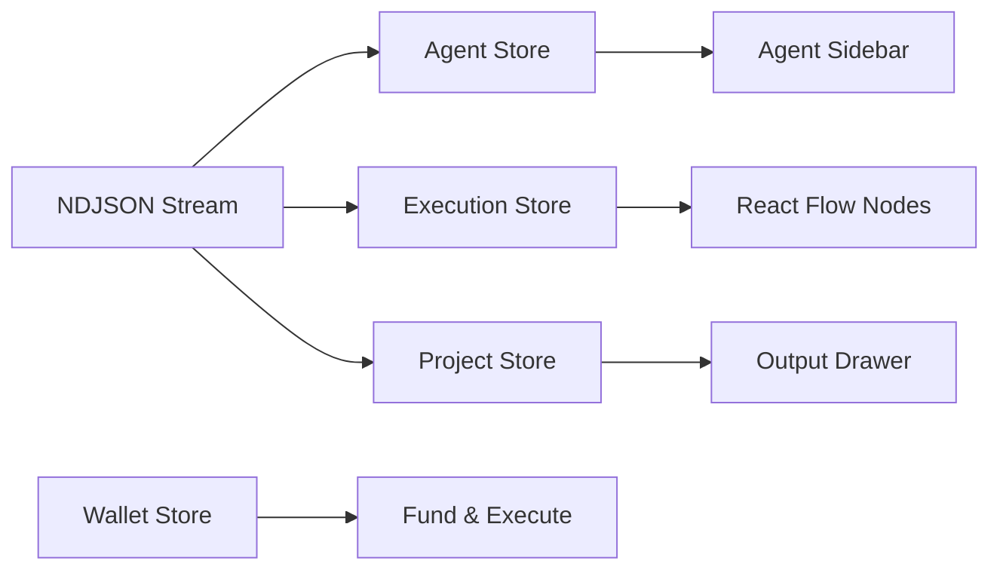
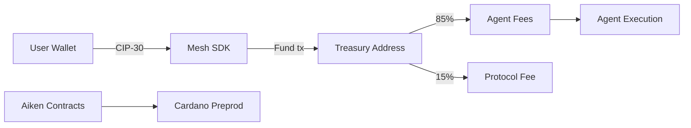

# Foundry

**Team name:** foundry  
**India Codex '26 submission** — Autonomous Software Companies on Cardano

> Describe an idea in plain language. Foundry scopes the work, assigns agents, and runs a tailored pipeline — contracts, frontend, docs, and deployment.

---

## Table of contents

- [Foundry](#foundry)
  - [Table of contents](#table-of-contents)
  - [Project overview](#project-overview)
  - [Problem statement](#problem-statement)
  - [Solution](#solution)
  - [Tech stack](#tech-stack)
  - [Architecture](#architecture)
    - [System overview](#system-overview)
    - [Layer structure](#layer-structure)
    - [Execution flow](#execution-flow)
    - [Default agent DAG](#default-agent-dag)
    - [Data flow (stores)](#data-flow-stores)
  - [Features \& routes](#features--routes)
    - [API routes](#api-routes)
  - [Agent system](#agent-system)
  - [Cardano integration](#cardano-integration)
  - [Smart contracts](#smart-contracts)
  - [Getting started](#getting-started)
    - [Prerequisites](#prerequisites)
    - [Install \& run](#install--run)
    - [Environment variables](#environment-variables)
  - [Presentation](#presentation)
  - [Demo \& screenshots](#demo--screenshots)
  - [Team members](#team-members)

---

## Project overview

**Foundry** is the operating system for autonomous software companies on Cardano. Users describe a product idea; Foundry uses AI to analyze scope, assemble a team of specialist agents, fund execution via a CIP-30 wallet, and orchestrate a live dependency DAG that produces deployable artifacts — including Aiken smart contracts, frontend scaffolds, security audits, documentation, and deployment plans.

This submission includes:

| Component | Location |
|-----------|----------|
| Frontend + backend (Next.js) | `src/`, `package.json` |
| Smart contracts (Aiken) | [`contracts/`](contracts/) — **separate on-chain codebase** |
| Presentation (HTML → PDF) | [`presentation.html`](presentation.html) |
| Setup guide | [`RUNBOOK.md`](RUNBOOK.md) |
| GitHub issue template | [`ISSUE_SUBMISSION.md`](ISSUE_SUBMISSION.md) |

---

## Problem statement

Building on Cardano requires many disciplines — market research, system architecture, Aiken development, frontend integration, security review, QA, documentation, and Preprod deployment. Today these steps are fragmented across tools, teams, and manual handoffs. Foundry unifies them into a single orchestrated workflow with on-chain funding and transparent agent execution.

---

## Solution

Foundry treats a software project as an **autonomous company**:

1. **Scope** — AI analyzes the project brief and selects which agents are needed
2. **Assemble** — CEO agent builds a dependency DAG; user can override the agent roster
3. **Fund** — User connects a Cardano Preprod wallet and funds a treasury before execution
4. **Execute** — Specialists run in parallel where dependencies allow; progress streams live to the UI
5. **Deliver** — Artifacts are downloadable per agent; Aiken contracts deploy to Preprod



---

## Tech stack

| Layer | Technologies |
|-------|----------------|
| **Frontend** | Next.js 16, React 19, Tailwind CSS 4, Framer Motion, React Flow, Recharts, Radix UI |
| **Backend** | Next.js API routes, NDJSON streaming, Node.js runtime |
| **AI** | OpenAI SDK / OpenRouter, structured JSON streaming, Zod validation |
| **Cardano** | Mesh SDK, CIP-30 wallets, Preprod network, lovelace treasury |
| **Smart contracts** | Aiken ≥1.1, `aiken-lang/stdlib` ≥2.1 |
| **Agent economy** | Masumi registry + payment APIs (mock mode for local dev) |
| **State** | Zustand (persisted projects, execution, agents, wallet) |
| **Tooling** | pnpm, TypeScript 5, ESLint |

---

## Architecture

### System overview



### Layer structure

```
foundry/
├── src/app/              # Pages + API routes (frontend + backend)
├── src/agents/           # CEO + 9 specialist agent implementations
├── src/services/         # Execution, OpenAI, Masumi, Cardano, scope analysis
├── src/store/            # Zustand state (projects, execution, agents, wallet)
├── src/components/       # UI (execution canvas, wallet, dashboard, landing)
├── src/features/         # Project creation wizard, output generation
├── src/hooks/            # useWallet, useExecutionStream, useMasumi
├── src/config/           # Agent roster, execution phases, site config
├── src/prompts/          # Per-agent system prompts
└── contracts/            # Aiken smart contracts (separate project)
```

### Execution flow



### Default agent DAG



- **CEO** orchestrates outside the DAG (scope + task decomposition)
- **Research** and **Architecture** always run (core agents)
- **Contract Engineer** and **Frontend Engineer** run **in parallel** after architecture
- DAG is **tailored** to project scope — optional agents omitted when not needed

### Data flow (stores)



---

## Features & routes

| Route | Description |
|-------|-------------|
| `/` | Landing page |
| `/dashboard` | Company dashboard — metrics, activity, health |
| `/projects` | Project list |
| `/projects/new` | 3-step wizard — details, AI scope, agent picker |
| `/projects/[id]` | Project detail, org chart, treasury |
| `/projects/[id]/execution` | Live React Flow DAG, wallet funding, streaming logs |
| `/projects/[id]/outputs` | Download generated artifacts |
| `/projects/[id]/deploy` | Aiken deployment pipeline (6 steps) |
| `/marketplace` | Masumi agent marketplace |
| `/settings` | AI model, Cardano network, execution speed |

### API routes

| Endpoint | Method | Description |
|----------|--------|-------------|
| `/api/analyze-scope` | POST | AI scope analysis → complexity + required agents |
| `/api/execution` | POST | NDJSON stream of execution events |

---

## Agent system

| Role | Name | Phase | Capabilities |
|------|------|-------|--------------|
| `ceo` | CEO | orchestration | Project analysis, DAG generation |
| `research` | Researcher | research | Tech analysis, risks, recommendations |
| `architecture` | Architect | architecture | System design, components, data flow |
| `contract-engineer` | Contract Engineer | contracts | Aiken development, validation |
| `frontend-engineer` | Frontend Engineer | frontend | React/Next.js UI, wallet integration |
| `security-engineer` | Security Engineer | security | Contract + frontend audit |
| `qa-engineer` | QA Engineer | testing | Test plans and cases |
| `documentation-engineer` | Documentation Engineer | documentation | README, API docs, Catalyst proposal |
| `deployment-engineer` | Deployment Engineer | deployment | Preprod deploy checklist |

**Scope detection** — AI analyzes the project brief and selects only the agents needed. Users can toggle specialists after analysis and reset to the AI pick.

**Outputs per agent** — Research summaries, architecture docs, `.ak` contract files, frontend scaffolds, security audits, QA plans, deployment guides, and Catalyst proposals.

---

## Cardano integration



- **Wallet** — CIP-30 via Mesh SDK (Vesper, Eternl, Nami, Lace); Preprod only
- **Funding** — User funds treasury before execution; mock mode when treasury not configured
- **Fees** — 85% agent allocation, 15% treasury fee
- **Deploy** — 6-step pipeline: compile → keys → faucet → build → submit → verify

---

## Smart contracts

Smart contract code lives in **[`contracts/`](contracts/)** as a **separate Aiken project** (not embedded in the Next.js app).

| Validator | File | Purpose |
|-----------|------|---------|
| **main** | `validators/main.ak` | Owner-signed spending validator |
| **lock** | `validators/lock.ak` | Timelock — lock ADA until deadline |
| **mint** | `validators/mint.ak` | Minting policy — owner mint, open burn |
| **vesting** | `validators/vesting.ak` | Linear vesting with cliff |

```bash
cd contracts
aiken check
aiken build
```

See [`contracts/README.md`](contracts/README.md) for full contract documentation.

---

## Getting started

### Prerequisites

| Tool | Version |
|------|---------|
| Node.js | ≥ 20 |
| pnpm | ≥ 9 |
| Aiken | ≥ 1.1 (optional, for contracts) |

### Install & run

```bash
cd foundry
pnpm install
cp .env.example .env.local   # add your keys
pnpm dev
```

Open **http://localhost:3000**

Full setup, env vars, and troubleshooting: **[RUNBOOK.md](RUNBOOK.md)**

### Environment variables

Copy `.env.example` to `.env.local`. Key variables:

| Variable | Description |
|----------|-------------|
| `OPENAI_API_KEY` | OpenAI or OpenRouter key (empty = mock mode) |
| `OPENAI_BASE_URL` | `https://openrouter.ai/api/v1` for OpenRouter |
| `OPENAI_MODEL` | e.g. `gpt-4o-mini` or `openai/gpt-oss-20b` |
| `NEXT_PUBLIC_CARDANO_NETWORK` | `preprod` |
| `NEXT_PUBLIC_TREASURY_ADDRESS` | Preprod treasury for funding txs |
| `MASUMI_MOCK` | `true` for local demo without Masumi infra |

---

## Presentation

**Files:**
- [`presentation.pdf`](presentation.pdf) — submission-ready PDF (14 pages)
- [`presentation.html`](presentation.html) — source deck (11 sections, editable)

The deck covers problem, solution, user flow, all platform features, execution engine, detailed agent roster, Cardano integration, smart contracts, tech stack, and demo instructions.

**Regenerate PDF** (after editing HTML):
```bash
"/Applications/Google Chrome.app/Contents/MacOS/Google Chrome" \
  --headless=new --disable-gpu --print-to-pdf-no-header \
  --print-to-pdf="presentation.pdf" \
  "file://$(pwd)/presentation.html"
```

---

## Demo & screenshots

### Presentation: [presentation.pdf](https://github.com/user-attachments/files/29939316/presentation.pdf)

#### Screenshots


#### Live Demo

[https://foundry-gamma-three.vercel.app/](https://foundry-gamma-three.vercel.app/)

#### YouTube Pitch Video

[https://youtu.be/6hji9L5TAM0](https://youtu.be/6hji9L5TAM0)

---

## Team members

| Name | Role | GitHub |
|------|------|--------|
| _Harish Kotra_ | _Builder_ | _[@harishkotra]_ |

> **Team name:** foundry
